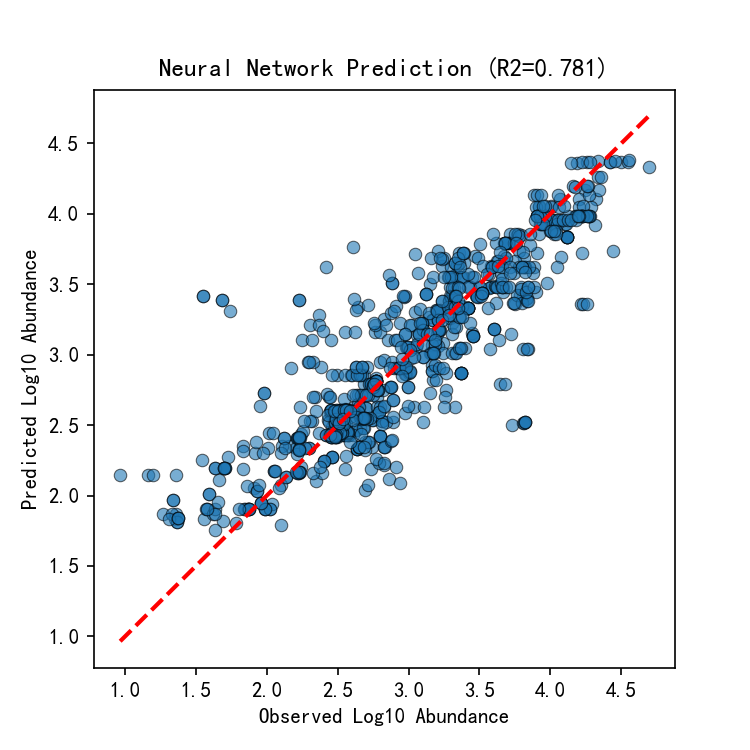

# 基于深度学习的全国湖库微塑料丰度预测

## 项目简介
本项目利用全国湖库微塑料采样数据，结合气候、地形、人口经济等环境协变量，构建了一个多层感知机（MLP）神经网络，用于预测微塑料丰度的空间分布。  
**研究目的**：探索深度学习在环境污染物空间建模中的应用，为微塑料的源汇分析和管控提供数据驱动支持。

**主要结果**：测试集 R² 达到 **0.784**，表明模型能够解释微塑料丰度空间变异的 78.4%。

## 数据集
- 文件：`湖库.xlsx`
- 样本量：约 4000+ 条记录（覆盖全国多个流域）
- 特征（10个）：
  - `Watershed zone`：流域分区
  - `水/沉积物`：水样（1）或沉积物（2）
  - `湖/库`：湖泊（0）或水库（1）
  - `Flood period`：洪涝期
  - `人口`、`Total GDP`、`人均GDP`：社会经济指标
  - `Altitude`：海拔
  - `Annual mean rainfall`：年均降雨量
  - `Annual mean temperature`：年均气温
- 目标变量：`Log10 Abundance (items/m3 or items/kg)`（对数变换后的微塑料丰度）

## 方法
### 数据预处理
- 将分类文本（湖/库）映射为数值（0/1）
- 删除含有缺失值的样本
- 特征和目标分别标准化（StandardScaler）

### 模型架构
- 输入层：10 个特征
- 隐藏层1：64 个神经元 + ReLU
- 隐藏层2：32 个神经元 + ReLU
- 输出层：1 个神经元（预测丰度）
- 损失函数：均方误差（MSE）
- 优化器：Adam（学习率 0.001）
- 训练轮数：200

### 评估指标
- 决定系数（R²）

## 结果
- **测试集 R² = 0.784**
- 预测值与实测值的散点图显示大部分点落在对角线附近，模型具有良好的泛化能力。

